[根目录](../../CLAUDE.md) > **tests**

# 测试套件 (tests)

> Qlib 的完整测试体系，包含单元测试、集成测试、性能测试和质量保证机制。

## 模块职责

tests 模块提供：
- 全面的单元测试覆盖
- 集成测试和端到端验证
- 性能基准测试和回归测试
- 质量保证和持续集成支持

## 测试架构

```mermaid
graph TD
    A["tests 测试套件"] --> B["核心测试"];
    A --> C["模块化测试"];
    A --> D["专项测试"];
    A --> E["测试配置"];
    A --> F["质量保证"];

    B --> B1["test_all_pipeline.py - 完整流程测试"];
    B --> B2["test_workflow.py - 工作流测试"];
    B --> B3["test_contrib_workflow.py - 扩展模块测试"];
    B --> B4["test_contrib_model.py - 模型测试"];

    C --> C1["backtest/ - 回测引擎测试"];
    C --> C2["model/ - 模型层测试"];
    C --> C3["ops/ - 操作符测试"];
    C --> C4["data_mid_layer_tests/ - 数据中层测试"];
    C --> C5["dataset_tests/ - 数据集测试"];
    C --> C6["dependency_tests/ - 依赖测试"];

    D --> D1["rl/ - 强化学习测试"];
    D --> D2["misc/ - 杂项功能测试"];
    D --> D3["storage_tests/ - 存储测试"];
    D --> D4["rolling_tests/ - 滚动处理测试"];

    E --> E1["pytest.ini - pytest 配置"];
    E --> E2["conftest.py - 测试配置"];
    E --> E3["config/ - 测试配置文件"];

    F --> F1["CI/CD 集成"];
    F --> F2["覆盖率统计"];
    F --> F3["性能基准"];
    F --> F4["质量门禁"];

    click B1 "./test_all_pipeline.py" "查看完整流程测试"
    click C4 "./data_mid_layer_tests/" "查看数据中层测试"
    click D1 "./rl/" "查看强化学习测试"
```



## 核心测试

### test_all_pipeline.py
**核心功能**：完整的量化研究流水线测试
**测试目标**：验证从数据到结果的完整流程

**主要测试内容**：
1. **环境初始化**：qlib 初始化正确性
2. **数据加载**：数据读取和处理功能
3. **模型训练**：模型训练流程验证
4. **策略执行**：策略回测正确性
5. **结果分析**：分析结果准确性

**测试流程**：
```python
def train(uri_path: str = None):
    """训练模型测试

    测试内容：
    - 数据准备和加载
    - 模型初始化和训练
    - 预测结果生成
    - 性能指标计算
    """
    # 初始化环境
    qlib.init(provider_uri=uri_path, region=REG_CN)

    # 准备数据和模型
    model = init_instance_by_config(CSI300_GBDT_TASK["model"])
    dataset = init_instance_by_config(CSI300_GBDT_TASK["dataset"])

    # 训练和验证
    model.fit(dataset)
    pred_score = model.predict(dataset)

    return pred_score, performance
```

### test_workflow.py
**核心功能**：工作流管理系统测试
**测试目标**：验证工作流的创建、执行和管理

### test_contrib_workflow.py
**核心功能**：扩展模块工作流测试
**测试目标**：验证 contrib 模块的集成功能

### test_contrib_model.py
**核心功能**：扩展模型测试
**测试目标**：验证各种模型实现的正确性

## 模块化测试

### backtest/ - 回测引擎测试
**测试范围**：
- **交易所模拟**：Exchange 类功能测试
- **执行器测试**：Executor 类各种场景
- **账户管理**：Account 类状态管理
- **持仓管理**：Position 类计算逻辑
- **策略测试**：文件策略、高频策略

**关键测试文件**：
- `test_file_strategy.py` - 文件策略测试
- `test_high_freq_trading.py` - 高频交易测试
- `test_soft_topk_strategy.py` - SoftTopK 成本控制策略测试 ⭐ **新增**
- `test_soft_topk_strategy_cold_start.py` - 冷启动场景测试 ⭐ **新增**

### model/ - 模型层测试
**测试范围**：
- **基础模型**：通用模型接口测试
- **神经网络模型**：深度学习模型测试
- **模型训练器**：训练流程测试

### ops/ - 操作符测试
**测试范围**：
- **基础操作符**：元素级操作测试
- **特殊操作符**：复杂操作符测试

**关键测试文件**：
- `test_elem_operator.py` - 基础操作符测试
- `test_special_ops.py` - 特殊操作符测试

### data_mid_layer_tests/ - 数据中层测试
**测试范围**：
- **数据处理器**：Handler 类功能测试
- **数据集**：Dataset 类功能测试
- **数据加载器**：DataLoader 功能测试
- **处理器**：Processor 类功能测试
- **存储处理器**：HandlerStorage 功能测试

**测试配置**：
```python
# 数据中层组件测试覆盖
- Handler: 数据处理管道
- Processors: 数据预处理组件
- Datasets: 数据集构建和管理
- DataLoaders: 高效数据加载
```

### dataset_tests/ - 数据集测试
**测试范围**：
- **数据层测试**：Datalayer 功能验证
- **数据集操作**：数据集操作正确性

### dependency_tests/ - 依赖测试
**测试范围**：
- **MLflow 集成**：实验管理功能测试
- **外部依赖**：第三方库集成测试

## 专项测试

### rl/ - 强化学习测试
**测试范围**：
- **数据队列**：强化学习数据流测试
- **环境模拟**：交易环境测试
- **日志系统**：强化学习日志测试
- **模拟器**：Qlib 模拟器测试
- **训练器**：强化学习训练器测试

**平台兼容性**：
```python
# 仅在 Linux 平台运行强化学习测试
if sys.platform != "linux":
    for root, dirs, files in os.walk("rl"):
        for file in files:
            collect_ignore.append(os.path.join(root, file))
```

**关键测试文件**：
- `test_data_queue.py` - 数据队列测试
- `test_finite_env.py` - 有限环境测试
- `test_logger.py` - 日志系统测试
- `test_qlib_simulator.py` - 模拟器测试
- `test_trainer.py` - 训练器测试

### misc/ - 杂项功能测试
**测试范围**：
- **多进程处理**：多进程数据获取测试
- **索引数据**：数据索引功能测试
- **SEPDF 功能**：SEPDF 处理测试
- **工具函数**：通用工具函数测试

**关键测试文件**：
- `test_get_multi_proc.py` - 多进程测试
- `test_index_data.py` - 索引数据测试
- `test_sepdf.py` - SEPDF 测试
- `test_utils.py` - 工具函数测试

### storage_tests/ - 存储测试
**测试范围**：
- **存储系统**：数据存储功能测试

### rolling_tests/ - 滚动处理测试
**测试范围**：
- **滚动预测**：滚动更新预测测试

## 测试配置系统

### pytest.ini
**配置内容**：
```ini
[pytest]
markers =
    slow: marks tests as slow (deselect with '-m "not slow"')
filterwarnings =
    ignore:.*rng.randint:DeprecationWarning
    ignore:.*Casting input x to numpy array:UserWarning
```

**功能说明**：
- **测试标记**：支持慢测试标记和选择性执行
- **警告过滤**：过滤已知的兼容性警告
- **测试发现**：自动发现和执行测试

### conftest.py
**配置功能**：
- **测试环境**：全局测试环境配置
- **平台适配**：不同平台的测试适配
- **测试夹具**：通用测试夹具定义

## 质量保证机制

### 测试覆盖率
- **目标覆盖率**：核心模块 80%+ 覆盖率
- **覆盖率统计**：定期生成覆盖率报告
- **增量覆盖**：新增代码必须包含测试

### 性能基准测试
- **基准建立**：建立性能基准线
- **回归检测**：检测性能回归问题
- **性能监控**：持续监控性能变化

### 持续集成
- **自动化测试**：CI/CD 流水线自动执行
- **质量门禁**：测试通过才能合并代码
- **报告生成**：自动生成测试报告

## 测试执行指南

### 本地测试执行
```bash
# 运行所有测试
pytest tests/

# 运行特定模块测试
pytest tests/data_mid_layer_tests/

# 运行慢测试
pytest tests/ -m slow

# 跳过慢测试
pytest tests/ -m "not slow"

# 生成覆盖率报告
pytest tests/ --cov=qlib --cov-report=html
```

### 性能测试执行
```bash
# 运行性能基准测试
pytest tests/test_performance.py

# 运行大数据量测试
pytest tests/test_large_data.py -v
```

### 特定平台测试
```bash
# 仅在 Linux 运行强化学习测试
pytest tests/rl/ --platform=linux
```

## 测试最佳实践

### 测试编写规范
1. **测试命名**：使用描述性的测试名称
2. **测试结构**：AAA 模式（Arrange, Act, Assert）
3. **测试隔离**：测试之间相互独立
4. **断言清晰**：明确的断言和错误信息

### 测试数据管理
1. **测试数据**：使用最小化的测试数据
2. **数据隔离**：测试数据与生产数据隔离
3. **数据清理**：测试后自动清理数据
4. **Mock 使用**：适当使用 mock 对象

### 性能测试规范
1. **基准明确**：明确的性能基准
2. **环境一致**：一致的测试环境
3. **多次运行**：多次运行取平均值
4. **结果记录**：记录详细的性能数据

## 常见问题与解决方案

### Q1: 测试运行失败怎么办？
1. 检查环境配置和依赖版本
2. 查看详细的错误信息和堆栈
3. 确认测试数据和配置文件
4. 检查平台兼容性问题

### Q2: 如何编写新测试？
1. 参考现有测试的结构和模式
2. 使用合适的测试夹具和工具
3. 确保测试的独立性和可重复性
4. 添加适当的测试文档和注释

### Q3: 如何调试测试失败？
1. 使用 pytest 的调试功能
2. 添加断点和日志输出
3. 检查测试数据和预期结果
4. 分析失败的根本原因

### Q4: 性能测试如何做？
1. 建立明确的性能基准
2. 使用合适的性能测试工具
3. 控制测试环境变量
4. 记录和分析性能数据

## 相关文件清单

### 核心测试文件
- `test_all_pipeline.py` - 完整流程测试
- `test_workflow.py` - 工作流测试
- `test_contrib_workflow.py` - 扩展模块工作流测试
- `test_contrib_model.py` - 扩展模型测试

### 模块测试目录
- `backtest/` - 回测引擎测试
- `model/` - 模型层测试
- `ops/` - 操作符测试
- `data_mid_layer_tests/` - 数据中层测试
- `dataset_tests/` - 数据集测试
- `dependency_tests/` - 依赖测试

### 专项测试目录
- `rl/` - 强化学习测试
- `misc/` - 杂项功能测试
- `storage_tests/` - 存储测试
- `rolling_tests/` - 滚动处理测试

### 配置文件
- `pytest.ini` - pytest 配置
- `conftest.py` - 测试配置
- `config/` - 测试配置文件

## 变更记录 (Changelog)

### 2026-02-10 11:20:00
- ✨ **新增 SoftTopK 策略测试**：
  - `test_soft_topk_strategy.py` - SoftTopK 成本控制策略回测测试
  - `test_soft_topk_strategy_cold_start.py` - 冷启动场景下的 impact limit 测试
- 📊 **测试覆盖范围**：
  - 验证 SoftTopkStrategy.generate_target_weight_position() 逻辑
  - 测试有无 impact limit 的行为差异
  - 覆盖清仓和目标仓位计算场景

### 2025-11-17 12:41:10
- ✨ 创建测试套件完整文档
- 📊 完成测试架构和分类分析
- 🔗 建立测试执行指南和最佳实践
- 📝 补充质量保证机制说明
- 🧪 新增测试配置和调试指南

<claude-mem-context>
# Recent Activity

<!-- This section is auto-generated by claude-mem. Edit content outside the tags. -->

### Feb 10, 2026

| ID | Time | T | Title | Read |
|----|------|---|-------|------|
| #2229 | 11:18 AM | 🔵 | Test suite documentation review reveals documentation gap | ~271 |
</claude-mem-context>