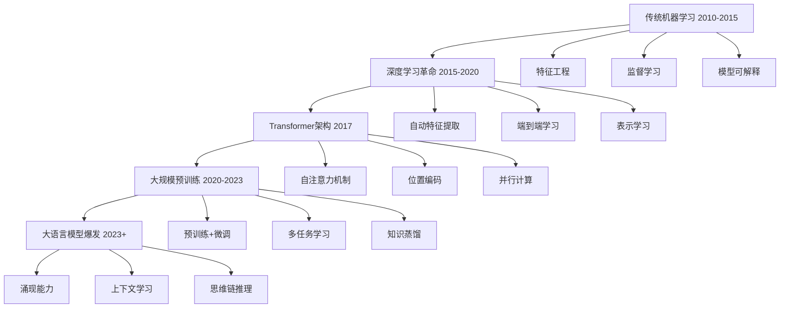
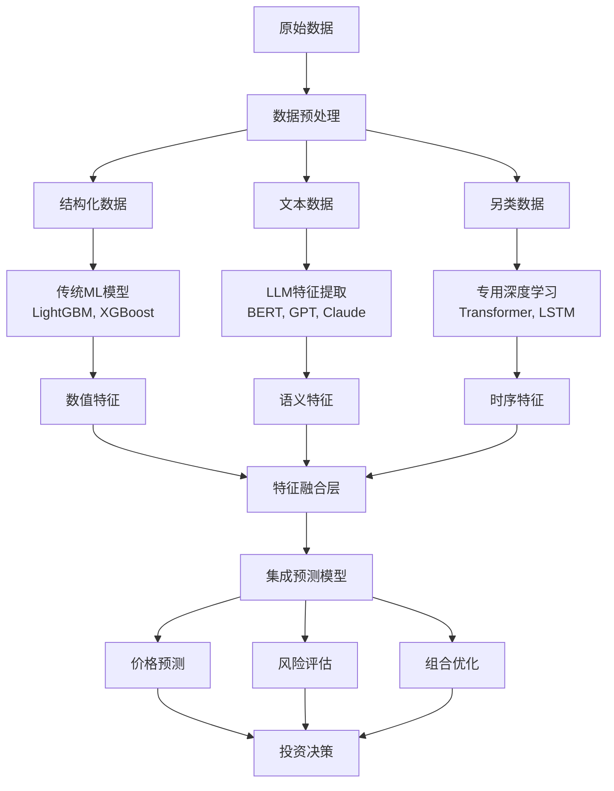
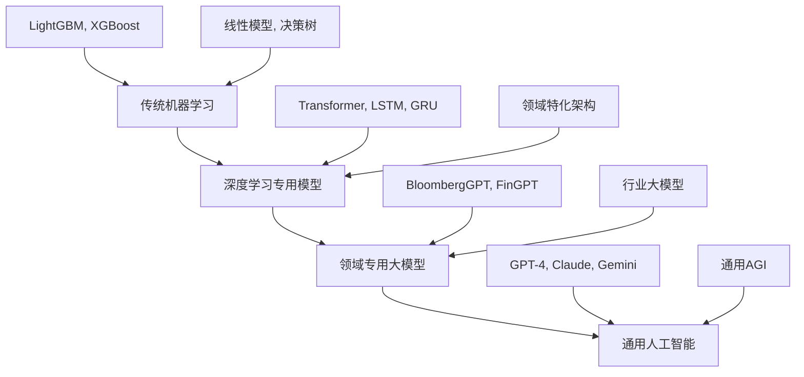

# 机器学习模型与大语言模型关系解读

> 基于 Qlib 量化投资平台的深度技术分析

---

## 1. 技术演进关系

### 发展路径

**传统机器学习 → 深度学习 → 大语言模型**

- **传统 ML** (LightGBM, XGBoost, 线性模型)：基于特征工程的结构化数据建模
- **深度学习** (DNN, LSTM, Transformer)：自动特征提取和表示学习
- **大语言模型** (GPT, BERT, Claude)：大规模预训练的通用智能体

### 技术继承与革新



---

## 2. Transformer 架构的关键连接

Qlib 中的 Transformer 模型是连接传统机器学习和大语言模型的重要桥梁：

### 核心技术组件

```python
# Qlib 中的 Transformer 模型 (量化投资专用)
class TransformerModel(nn.Module):
    def __init__(self, d_feat=20, d_model=64, nhead=2, num_layers=2):
        # 核心组件与 LLM 相似
        self.feature_layer = nn.Linear(d_feat, d_model)
        self.pos_encoder = PositionalEncoding(d_model)  # 位置编码
        self.transformer_encoder = nn.TransformerEncoder(
            nn.TransformerEncoderLayer(d_model, nhead),
            num_layers
        )
        self.decoder_layer = nn.Linear(d_model, 1)
```

### 共同技术基础

- **自注意力机制**：捕捉序列中元素的依赖关系
- **位置编码**：处理序列顺序信息
- **多头注意力**：并行学习多种表示模式
- **残差连接**：深度网络训练稳定性
- **层归一化**：训练收敛加速

### 架构对比

| 组件 | Qlib Transformer | 大语言模型 | 作用差异 |
|------|------------------|------------|----------|
| **嵌入层** | 特征映射 (d_feat → d_model) | 词汇嵌入 | 数值特征 vs 语言符号 |
| **位置编码** | 正弦位置编码 | 学习位置编码 | 时序位置 vs 句子位置 |
| **注意力头数** | 2-4 个 | 8-96 个 | 模型复杂度差异 |
| **层数** | 2-6 层 | 12-96 层 | 计算资源约束 |
| **输出层** | 单一预测输出 | 词汇概率分布 | 回归 vs 生成 |

---

## 3. 应用场景的差异化

### 应用维度分析

| 维度 | 传统机器学习 | 专用深度学习 | 大语言模型 |
|------|-------------|-------------|------------|
| **输入模态** | 结构化表格数据 | 时序数据、数值特征 | 自然语言、多模态 |
| **预训练方式** | 无预训练 | 随机初始化训练 | 大规模语料预训练 |
| **领域知识** | 人工特征工程 | 自动特征提取 | 隐含在预训练中 |
| **可解释性** | 高 (SHAP, 特征重要性) | 中等 | 低 (黑盒) |
| **计算资源** | 低 (CPU) | 中等 (GPU) | 高 (大算力) |
| **部署成本** | 低 | 中等 | 高 |
| **泛化能力** | 弱 | 中等 | 强 |

### 典型应用场景

#### 传统机器学习优势场景
```python
# LightGBM 在量化投资中的典型应用
model = LGBModel(
    loss="mse",
    num_leaves=31,
    learning_rate=0.1,
    feature_fraction=0.9
)

# 适用场景：
# 1. 结构化表格数据 (财务指标、技术指标)
# 2. 特征工程完善的数据集
# 3. 需要快速迭代和解释的场景
# 4. 计算资源受限的环境
```

#### 专用深度学习优势场景
```python
# ALSTM 模型在时序预测中的应用
model = ALSTMModel(
    input_size=20,
    hidden_size=64,
    num_layers=2,
    dropout=0.2
)

# 适用场景：
# 1. 时间序列数据的长期依赖建模
# 2. 需要自动特征提取的场景
# 3. 复杂非线性关系的捕捉
# 4. 局部趋势和周期性模式识别
```

#### 大语言模型优势场景
```python
# LLM 在投资研究中的应用示例
def analyze_financial_news(news_texts, stock_data):
    # 使用 LLM 分析新闻情感
    sentiment_scores = llm_analyze_sentiment(news_texts)

    # 结合结构化数据进行预测
    features = combine_features(sentiment_scores, stock_data)
    predictions = ml_model.predict(features)

    return predictions

# 适用场景：
# 1. 非结构化文本信息处理
# 2. 多源信息融合分析
# 3. 复杂逻辑推理和解释
# 4. 跨领域知识迁移
```

---

## 4. Qlib 模型的独特定位

### 量化投资专用模型架构

#### 1. ALSTM (注意力增强 LSTM)
```python
class ALSTMModel(nn.Module):
    """注意力增强的 LSTM 模型"""
    def __init__(self, d_feat, hidden_size, num_layers):
        super().__init__()
        self.rnn = nn.LSTM(d_feat, hidden_size, num_layers, batch_first=True)
        self.attention = nn.MultiheadAttention(hidden_size, num_heads=8)
        self.fc = nn.Linear(hidden_size, 1)

    def forward(self, x):
        # RNN 提取时序特征
        rnn_out, _ = self.rnn(x)

        # 注意力机制加权
        attn_out, _ = self.attention(rnn_out, rnn_out, rnn_out)

        # 最终预测
        return self.fc(attn_out[:, -1, :])
```

**特点：**
- 融合了循环神经网络和注意力机制
- 适合金融时序数据的局部趋势捕捉
- 能够自动关注重要的时间步

#### 2. LocalFormer (局部 Transformer)
```python
class LocalformerEncoder(nn.Module):
    """局部窗口 Transformer 编码器"""
    def __init__(self, d_model, nhead, window_size, num_layers):
        super().__init__()
        self.conv_layers = nn.ModuleList([
            nn.Conv1d(d_model, d_model, kernel_size=window_size, padding=window_size//2)
            for _ in range(num_layers)
        ])
        self.transformer_layers = nn.ModuleList([
            nn.TransformerEncoderLayer(d_model, nhead)
            for _ in range(num_layers)
        ])

    def forward(self, x):
        for conv, transformer in zip(self.conv_layers, self.transformer_layers):
            # 局部卷积特征提取
            conv_out = conv(x.transpose(1, 2)).transpose(1, 2)
            # 残差连接
            x = x + conv_out
            # Transformer 全局建模
            x = transformer(x)
        return x
```

**特点：**
- 引入局部窗口注意力机制
- 降低计算复杂度，适合长序列处理
- 结合了局部特征提取和全局依赖建模

#### 3. TRA (时序关系感知)
```python
class TRAModel(nn.Module):
    """时序关系感知模型"""
    def __init__(self, d_feat, d_model, n_stocks, num_layers):
        super().__init__()
        self.stock_embedding = nn.Embedding(n_stocks, d_model)
        self.feature_encoder = nn.Linear(d_feat, d_model)
        self.relation_encoder = nn.TransformerEncoder(
            nn.TransformerEncoderLayer(d_model, nhead=8),
            num_layers
        )
        self.predictor = nn.Linear(d_model, 1)

    def forward(self, features, stock_ids):
        # 股票编码
        stock_emb = self.stock_embedding(stock_ids)
        # 特征编码
        feat_emb = self.feature_encoder(features)
        # 关系建模
        combined_emb = stock_emb + feat_emb
        relation_out = self.relation_encoder(combined_emb)
        return self.predictor(relation_out)
```

**特点：**
- 专门建模股票间的时间序列关系
- 适用于投资组合管理
- 能够捕捉股票间的相关性和传导效应

---

## 5. 与大语言模型的互补关系

### 协同应用的典型场景

#### 1. 信息提取 + 数值建模

```python
class HybridInvestmentModel:
    """混合投资分析模型"""
    def __init__(self, llm_model, ml_model):
        self.llm_model = llm_model  # 大语言模型
        self.ml_model = ml_model      # 机器学习模型

    def analyze_and_predict(self, news_data, market_data):
        # LLM 负责：新闻情感分析、财报解读、政策影响评估
        text_features = self.llm_model.extract_features(news_data)

        # ML 模型负责：基于结构化数据的价格预测
        combined_features = combine_features(text_features, market_data)
        predictions = self.ml_model.predict(combined_features)

        return predictions, text_features
```

#### 2. 决策支持 + 执行优化

```python
class InvestmentDecisionSystem:
    """投资决策系统"""
    def __init__(self, strategy_llm, execution_ml):
        self.strategy_llm = strategy_llm    # 策略生成 LLM
        self.execution_ml = execution_ml      # 执行优化 ML

    def make_investment_decision(self, market_context, portfolio_state):
        # LLM 负责：投资逻辑解释、风险评估、策略生成
        strategy_advice = self.strategy_llm.generate_strategy(
            market_context, portfolio_state
        )

        # ML 模型负责：具体信号生成、仓位优化
        execution_signals = self.execution_ml.generate_signals(
            market_context, strategy_advice
        )

        return strategy_advice, execution_signals
```

### 多模型融合架构



---

## 6. 技术发展趋势

### 当前阶段的特点



### 发展路径预测

#### 短期 (1-2年)
- **模型融合**：传统模型的精确性 + 大模型的泛化能力
- **混合部署**：关键路径使用传统模型，辅助路径使用 LLM
- **特征工程优化**：利用 LLM 自动生成特征

#### 中期 (2-5年)
- **领域专用大模型**：金融领域专用的大规模预训练模型
- **端到端优化**：从信息获取到投资决策的完整链条
- **实时学习**：基于市场反馈的持续学习机制

#### 长期 (5+年)
- **AGI 在投资中的应用**：通用人工智能在复杂决策中的应用
- **自主投资代理**：能够独立进行研究和决策的 AI 系统
- **市场生态重构**：AI 改变市场参与者的行为模式

---

## 7. 实践建议

### 选择模型的决策树

```python
def choose_optimal_model(data_characteristics, requirements):
    """模型选择决策函数"""

    # 数据规模判断
    if data_characteristics['sample_size'] < 10000:
        if requirements['interpretability'] == 'high':
            return 'LightGBM + SHAP'
        else:
            return 'Linear Models'

    # 数据类型判断
    if data_characteristics['data_type'] == 'pure_numeric':
        if data_characteristics['temporal'] == True:
            return 'LSTM/GRU + Attention'
        else:
            return 'Deep Neural Networks'

    # 文本信息判断
    if data_characteristics['has_text'] == True:
        if requirements['performance'] == 'highest':
            return 'LLM Fine-tuning + Ensemble'
        else:
            return 'LLM Feature Extraction + ML'

    # 复杂度判断
    if data_characteristics['complex_relations'] == True:
        return 'Transformer-based Models'

    # 实时性要求
    if requirements['latency'] == 'very_low':
        return 'LightGBM or Linear Models'

    # 默认选择
    return 'Ensemble of Multiple Approaches'
```

### 具体场景建议

#### 1. 数据量小 (< 10K 样本)
**推荐方案：**
- **主模型**：LightGBM + 特征工程
- **辅助**：SHAP 值进行特征重要性分析
- **优势**：训练快速、不易过拟合、可解释性强

```python
# 实现示例
model = LGBModel(
    loss="mse",
    num_leaves=15,  # 减少过拟合
    learning_rate=0.05,  # 较小学习率
    feature_fraction=0.8,  # 特征采样
    bagging_fraction=0.8,  # 样本采样
    bagging_freq=5  # 频率
)
```

#### 2. 纯数值时序数据
**推荐方案：**
- **主模型**：LSTM/GRU + 注意力机制
- **优化**：时间序列交叉验证
- **特点**：能够捕捉长期依赖和季节性模式

```python
# 实现示例
model = ALSTMModel(
    input_size=num_features,
    hidden_size=64,
    num_layers=2,
    dropout=0.2,
    attention_heads=8
)
```

#### 3. 需要解释性
**推荐方案：**
- **主模型**：TabNet + SHAP 分析
- **备选**：LightGBM + 特征重要性
- **优势**：内置特征选择、天然可解释

```python
# 实现示例
model = TabNetModel(
    n_d=64, n_a=64,  # 决策和注意力维度
    n_steps=5,      # 决策步数
    gamma=1.5,      # 稀疏控制
    lambda_sparse=1e-3  # 稀疏正则化
)
```

#### 4. 多源信息融合
**推荐方案：**
- **文本处理**：LLM 特征提取
- **数值建模**：Transformer 架构
- **融合策略**：早期融合或晚期融合

```python
# 实现示例
class MultiModalModel(nn.Module):
    def __init__(self, text_encoder, numeric_encoder, fusion_layer):
        super().__init__()
        self.text_encoder = text_encoder  # LLM-based
        self.numeric_encoder = numeric_encoder  # Transformer-based
        self.fusion_layer = fusion_layer

    def forward(self, text_data, numeric_data):
        text_features = self.text_encoder(text_data)
        numeric_features = self.numeric_encoder(numeric_data)
        combined_features = self.fusion_layer(text_features, numeric_features)
        return combined_features
```

#### 5. 复杂关系建模
**推荐方案：**
- **图神经网络**：股票关系建模
- **Transformer**：全局依赖建模
- **集成方法**：多模型集成

```python
# 实现示例
class ComplexRelationModel(nn.Module):
    def __init__(self, gnn_layer, transformer_layer, predictor):
        super().__init__()
        self.gnn_layer = gnn_layer      # 图关系建模
        self.transformer_layer = transformer_layer  # 时间关系建模
        self.predictor = predictor      # 集成预测器

    def forward(self, node_features, edge_features, temporal_features):
        # 图关系建模
        graph_features = self.gnn_layer(node_features, edge_features)

        # 时间关系建模
        temporal_features = self.transformer_layer(temporal_features)

        # 集成预测
        combined_features = torch.cat([graph_features, temporal_features], dim=-1)
        predictions = self.predictor(combined_features)

        return predictions
```

---

## 8. 技术洞察

### 关键认知

#### 1. 架构继承性
- Qlib 的 Transformer 模型与大语言模型共享核心技术
- 但针对量化投资场景进行了深度优化
- 体现了从通用技术到领域应用的演进

#### 2. 性能互补性
- 传统机器学习模型在特定场景下仍具有性能和效率优势
- 深度学习模型在复杂关系建模方面具有优势
- 大语言模型在处理非结构化信息方面具有独特价值

#### 3. 融合趋势
- 未来趋势是技术融合而非完全替代
- 各模型在不同环节发挥优势
- 混合架构将成为主流

### 技术成熟度评估


### 未来发展方向

#### 技术融合
- **特征层面融合**：LLM 提取的语义特征 + 传统数值特征
- **模型层面融合**：不同模型的优势互补
- **决策层面融合**：多模型投票和权重调整

#### 领域适配
- **金融专用预训练**：基于金融语料的大模型预训练
- **任务特定微调**：针对特定投资任务的模型优化
- **实时学习能力**：基于市场反馈的持续学习

#### 工程优化
- **推理加速**：模型压缩、量化、蒸馏
- **部署优化**：边缘计算、分布式推理
- **监控系统**：模型性能衰退检测和自动更新

---

## 结论

机器学习模型与大语言模型之间并非简单的替代关系，而是一个**分层协作的技术生态系统**：

1. **技术继承**：大语言模型继承了传统深度学习的核心技术
2. **场景分化**：不同技术在各自优势场景中发挥重要作用
3. **能力互补**：通过技术融合实现 1+1>2 的效果
4. **持续演进**：技术边界不断模糊，融合程度不断加深

在量化投资领域，这种分层的技术架构体现了从专业应用到通用智能的演进路径，每个层次都在其适用范围内发挥不可替代的作用。未来成功的系统将是能够根据具体需求，灵活调用和组合不同技术层次的混合智能系统。

---

*本文档基于 Qlib 量化投资平台的深度技术分析，为理解机器学习模型与大语言模型的关系提供了系统的视角。*